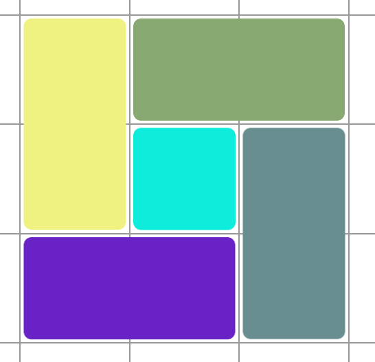

# Pegboard - Frontend
## Generic dashboard maker
 
    

- Create a generic dashboard and integrate with different web applications.

### TODO - Base component
- [X] Allow component resize
- [X] Allow component positioning
- [X] Component responsiveness
- [X] Collision detection fallback
- [X] Component snapping to grid
- [X] Resizeable grid

### Integrations
- [ ] iframe - generic support
- [ ] Jira
- [ ] Github
- [ ] Gitlab